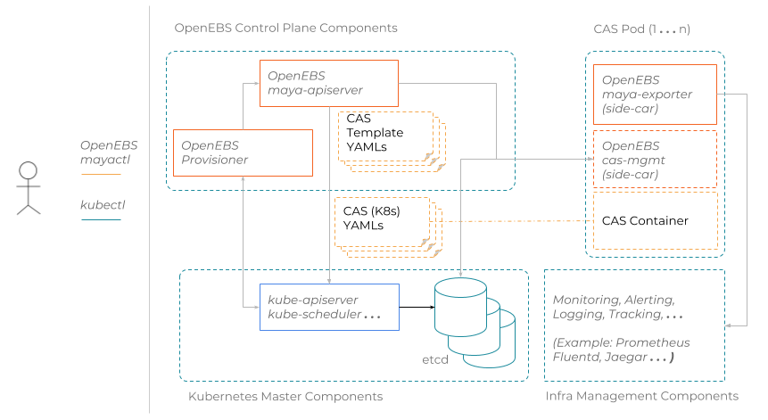

## Overview

*Visit [https://docs.openebs.io](https://docs.openebs.io) to learn about Container Attached Storage(CAS) and full documentation on using OpenEBS Maya*.

## Project Status: Deprecated

Although all the components still work, this repo is now deprecated, moving work to following repo, come join us there !

- [cstor-operators](https://github.com/openebs/cstor-operators)
- [Jiva-operators](https://github.com/openebs/jiva-operator)
- [LocalPV](https://github.com/openebs/dynamic-localpv-provisioner)

*OpenEBS Maya* extends the capabilities of Kubernetes to orchestrate CAS (aka Container Native) Storage Solutions like OpenEBS Jiva, OpenEBS cStor, etc. *Maya* (meaning *Magic*), seamlessly integrates into the Kubernetes Storage Workflow and helps provision and manage the CAS based Storage Volumes. The core-features of *Maya* include:

-   Maintaining the inventory of the underlying disks on the Kubernetes Nodes.

-   Managing the allocation of Disks to CAS Storage Engines.

-   Provisioning of CAS Volumes by interfacing with K8s Dynamic Volume Provisioner.

-   Managing the high availability of the CAS volumes by tuning the scheduling parameters of CAS Deployments (Pods).

-   Provide adapters to CAS Volumes to interact with Kubernetes and related infrastructure components like Prometheus, Grafana etc.

*Maya* orchestration and management capabilities are delivered through a set of services and tools. Currently, these services support deploying the CAS Storage Solutions in Kubernetes Clusters. In future, these can be extended to support other Container Orchestrators.

## Maya Architecture

**Maya** components can be broadly classified based on their deployment type as follows:

-   **Control Plane Components** - These are containers that are initialized as part of enabling OpenEBS in a Kubernetes cluster.
    -   *maya-apiserver* helps with the creation of CAS Volumes and provides API endpoints to manage those volumes. *maya-apiserver* can also be considered as a template engine that can be easily extended to support any kind of CAS storage solutions. It takes as input a set of CAS templates that are converted into CAS K8s YAMLs based on user requests.
    -   *provisioner* is an implementation of Kubernetes Dynamic Provisioner that processes the PVC requests by interacting with maya-apiserver.

-   **CAS Side-car Components** - These are adapter components that help with managing the CAS containers that do not inherently come up with the required endpoints. For example:
    -   *maya-exporter* helps in providing a metrics endpoint to the CAS container.
    -   *cas-mgmt* components can be attached as side-cars for helping to store/retrieve configuration information from Kubernetes Config Store (etcd). For cStor CAS solution, cstor-pool-mgmt is one such *cas-mgmt* component.

-   **CLI** - While most of the operations can be performed via the kubectl, *Maya* also comes with *mayactl* that helps retrieve storage related information for debugging/troubleshooting storage related issues.

## Install

Please refer to our documentation at [OpenEBS Documentation](http://docs.openebs.io/).

## Contributing

Head over to the [CONTRIBUTING.md](./CONTRIBUTING.md).

## Community

OpenEBS welcomes your feedback and contributions in any form possible.

- [Join OpenEBS community on Kubernetes Slack](https://kubernetes.slack.com)
  - Already signed up? Head to our discussions at [#openebs](https://kubernetes.slack.com/messages/openebs/)
- Want to raise an issue or help with fixes and features?
  - See [open issues](https://github.com/openebs/openebs/issues)
  - See [contributing guide](./CONTRIBUTING.md)
  - See [Project Roadmap](https://github.com/orgs/openebs/projects)
  - Checkout our existing [adopters](https://github.com/openebs/openebs/tree/master/adopters) and their [feedbacks](https://github.com/openebs/openebs/issues/2719).
  - Want to join our contributor community meetings, [check this out](https://hackmd.io/mfG78r7MS86oMx8oyaV8Iw?view).
- Join our OpenEBS CNCF Mailing lists
  - For OpenEBS project updates, subscribe to [OpenEBS Announcements](https://lists.cncf.io/g/cncf-openebs-announcements)
  - For interacting with other OpenEBS users, subscribe to [OpenEBS Users](https://lists.cncf.io/g/cncf-openebs-users)

## More Info

-   Design proposals for *Maya* components are located at [OpenEBS Designs directory](https://github.com/openebs/openebs/tree/master/contribute/design).

-   The issues related to *Maya* are logged under [openebs/openebs](https://github.com/openebs/openebs/issues).

-   To build Maya from the source code, see [developer's documentation](https://github.com/openebs/maya/blob/master/docs/developer.md).

-   Maya uses [golang dep](https://github.com/golang/dep) to manage dependencies.

-   The source code for OpenEBS Provisioner is available at [openebs/external-storage](https://github.com/openebs/external-storage).

-   *mayactl* is shipped along with the maya-apiserver container.

## License

